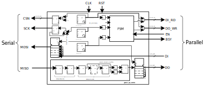
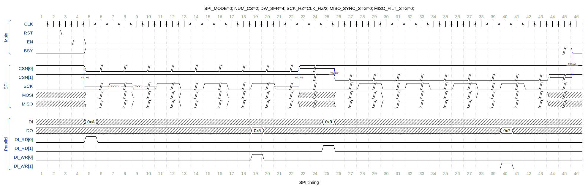
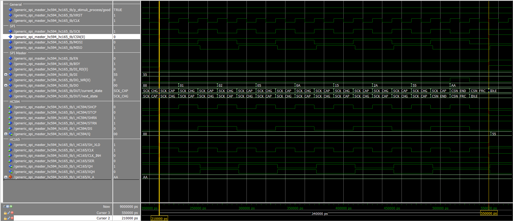

# Generic [SPI](https://en.wikipedia.org/wiki/Serial_Peripheral_Interface) Master

_Serial Peripheral Interface_ (SPI) Master with an arbitrary number of chip-selects

## Releases

| Version                                                            | Date       | Source                                                                                                | Change log                                                                               |
| ------------------------------------------------------------------ | ---------- | ----------------------------------------------------------------------------------------------------- | ---------------------------------------------------------------------------------------- |
| latest                                                             |            | <a id="raw-url" href="https://github.com/akaeba/generic_spi_master/archive/master.zip">latest.zip</a> |                                                                                          |
| [v0.2.0](https://github.com/akaeba/generic_spi_master/tree/v0.2.0) | 2021-08-31 | <a id="raw-url" href="https://github.com/akaeba/generic_spi_master/archive/v0.2.0.zip">v0.2.0.zip</a> | bugfix strobe sync length, introduce CI                                                  |
| [v0.1.0](https://github.com/akaeba/generic_spi_master/tree/v0.1.0) | 2021-03-29 | <a id="raw-url" href="https://github.com/akaeba/generic_spi_master/archive/v0.1.0.zip">v0.1.0.zip</a> | initial draft                                                                            |

## Key features

* SPI mode 0-3
* Arbitrary number of chip-selects (CSN)
* Adjustable shift register width
* FSCK,max=FCLK/2
* FSCK settable at compile
* MISO input filter
* round-robin CSN arbitration, starting at low index
* no parallel buffer registers for minimal resource footprint
* independent MOSI/MISO shift register path

## Interface

### Generics

| Name          | Type     | Default    | Description                                                          |
| ------------- | -------- | ---------- | -------------------------------------------------------------------- |
| SPI_MODE      | integer  | 0          | used transfer mode                                                   |
| NUM_CS        | positive | 1          | Number of Channels (chip-selects)                                    |
| DW_SFR        | integer  | 8          | data width serial in/out shift register                              |
| CLK_HZ        | positive | 50_000_000 | clock frequency                                                      |
| SCK_HZ        | positive | 1_000_000  | Bit clock rate - can be higher due numeric rounding effects          |
| RST_ACTIVE    | bit      | 1          | Reset active level                                                   |
| MISO_SYNC_STG | natural  | 0          | number of MISO sync stages, 0: not implemented                       |
| MISO_FILT_STG | natural  | 0          | number of evaluated sample bits for hysteresis, 0/1: not implemented |

_Settable at compile time._

### Ports

| Port  | Direction | Width  | Description                                                  |
| ----- | --------- | ------ | ------------------------------------------------------------ |
| RST   | in        | 1      | asynchronous reset                                           |
| CLK   | in        | 1      | clock (rising edge)                                          |
| CSN   | out       | NUM_CS | chip select                                                  |
| SCK   | out       | 1      | shift forward clock                                          |
| MOSI  | out       | 1      | serial data out (master-out-slave-in)                        |
| MISO  | in        | 1      | serial data in  (master-in-slave-out)                        |
| DI    | in        | DW_SFR | Parallel data-in, transmitted via MOSI                       |
| DO    | out       | DW_SFR | Parallel data-out, received via MISO                         |
| EN    | in        | 1      | start transfer                                               |
| BSY   | out       | 1      | transmission active                                          |
| DI_RD | out       | NUM_CS | load MOSI SFR with data; indexes CSN aligned                 |
| DO_WR | out       | NUM_CS | store MISO SFR data in capture register; indexes CSN aligned |

## SPI Modes

|  SPI Mode | CPOL | CPHA |
| --------- | ---- | ---- |
|  0        |  0   |   0  |
|  1        |  0   |   1  |
|  2        |  1   |   0  |
|  3        |  1   |   1  |

 

 

## Architecture

 

 

### MISO input filter

The _generic_spi_master_ allows to consider the _MISO_ data input as asynchronous. This asynchronicity can be caused by ESD events at sampling time. To resolve
the potentially issue implements the _generic_spi_master_ via generic a input synchronizer and a filter stage. The picture below shows the data sampling time
and the evaluated sampling points with an active filter for the spi mode 0. The SFR input changes only, when all bits in the filter stage or one or zero.

 

 

## Timing

 

 

## Resource allocation

| Technology | HDL generics    | Logic | Registers | BRAM | Fmax |
| ---------- | --------------- | ----- | --------- | ---- | --------------- |
| Cyclone 10 | entity defaults | 48LEs | 34FF      | 0    | 93.64MHz        |

## Example

In this example interfaces the [SPI master](./hdl/generic_spi_master.vhd) in mode 2 an parallel-in ([HC165](https://www.ti.com/lit/ds/symlink/sn74hc165.pdf))
and parallel-out ([HC594](https://www.ti.com/lit/ds/symlink/sn74hc594.pdf)) shift register.
The waveform shows the [testbenchs](./tb/generic_spi_master_HC594_HC165_tb.vhd) output.

## References

* [Wikipedia: SPI](https://en.wikipedia.org/wiki/Serial_Peripheral_Interface)
